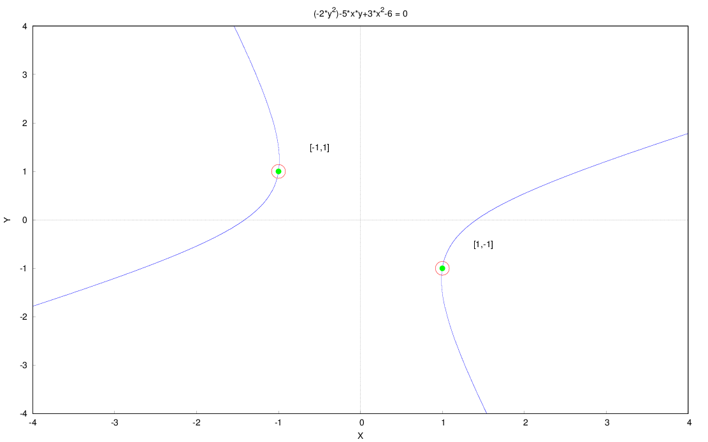

Maxima program to solve diophantine equations of the form ax^2+bxy+cy^2+dx+ey+f=0 with a,b,c,d,e,f constant integers.
Based on Dario Alpern's solution/code found at https://www.alpertron.com.ar/QUAD.HTM

[Installing](README.md#install)  
[Usage](README.md#usage)  
[Limitations](README.md#limitations)  
[Tests](README.md#tests)  
[Graphical examples](README.md#graphical-examples)  

## Install
Put the source in some folder, and in maxima do something like

	(%i1) diophantine_source_dir:"<some-folder>"$
	(%i2) push(sconcat(diophantine_source_dir, "$$$.mac"), file_search_maxima)$
	(%i3) push(sconcat(diophantine_source_dir, "$$$.lisp"), file_search_lisp)$

It might be useful to put these lines in your maxima-init.mac

## Usage

	(%i1) load(diophantine)$

	(%i2) diophantine_solve(-9*x+11*y=5);
	(%o2) [[x = 11*%n - 3,y = 9*%n - 2]]

The result is always a (possibly empty) list of values. When there are infinitely many solutions, the solution contains a %n, which means "any integer". Some equations have several sets of those, e.g.

	(%i3) diophantine_solve(18*y^2-24*x*y+7*y+8*x^2+5*x+16);
	(%o3) [[x = (-174*%n^2)+17*%n-2,y = (-116*%n^2)+21*%n-2], [x = (-174*%n^2)+41*%n-4,y = (-116*%n^2)+37*%n-4]]

Generating some specific values when the solution contains %n can be done like this

	(%i4) diophantine_solve(3*x+2*y-8);
	(%o4) [[x=2*%n+2,y=1-3*%n]]

	(%i5) diophantine_instantiate_solutions(%o4,-3,3);
	(%o5) [[x = - 4, y = 10], [x = - 2, y = 7], [x = 0, y = 4], [x = 2, y = 1],
	      	  [x = 4, y = - 2], [x = 6, y = - 5], [x = 8, y = - 8]]

## Limitations

The hyperbolic case (b^2-4*a*c>0) is work in progress. Pell equations (x^2-Dy^2=N)  can now be solved if D and N are not too large.

## Tests

There is a file with tests available, run it like this:

	(%i6) batch(rtest_diophantine);

## Graphical examples:

	(%i7) load(diophantine_draw)$
	(%i8) dio_draw_example();

	(%i9) dio_draw_example2();

	(%i10) dio_draw_example3();

	(%i11) dio_draw_example4();

